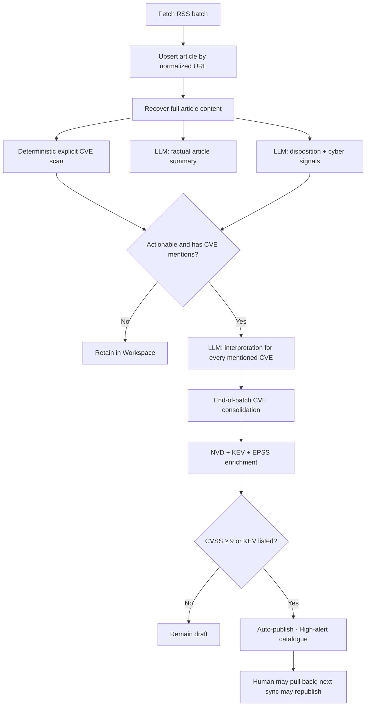

# CVE Intelligence MVP Architecture

> **Living architecture note (2026-07-19).** Publication and the per-CVE LLM task follow [ADR 0011](../adr/0011-high-alert-cve-auto-publication.md): cases auto-publish on CVSS ≥ 9 or KEV listing; public list orders by Published date (HKT day) → KEV → EPSS → CVSS; the LLM returns interpretations, not relevance verdicts.

## Outcome

Reframe Threat Watch as a CVE-centred intelligence workflow rather than a vendor-filtered news digest. The MVP ingests low-volume cyber-news batches, extracts full articles, identifies explicit CVEs, interprets each article–CVE mention, enriches every draft case with authoritative sources, and publishes **high-alert** CVE evidence automatically when NVD CVSS ≥ 9 or CISA KEV lists the CVE.

The system is an agentic workflow, not an autonomous investigator. LLMs perform bounded reasoning inside a deterministic, resumable pipeline; Postgres remains the system of record.

## Agent patterns

The MVP deliberately combines a small set of useful patterns:

- **Sequential workflow:** ingest → extract → scan → analyse → consolidate → enrich → (auto) publish; humans review and may pull back.
- **Parallelization:** factual summary and disposition analysis run independently after full-text extraction.
- **Routing:** disposition and explicit CVE mentions determine whether CVE interpretation analysis is eligible.
- **Tool use:** typed deterministic clients retrieve NVD, CISA KEV, and EPSS data; the LLM does not invent enrichment.
- **Human in the loop:** analysts label article–CVE links and may pull published cases back; they do not Approve as the publication gate.
- **Evaluator feedback:** retained predictions, failures, and corrections feed a labelled scorecard for later automation.

An open-ended investigation agent, organizational asset matching through MDE, notification channels, and semantic event grouping are deferred.

## Workflow

## Stage contracts

### 1. Ingest and URL identity

- Repeated feed fetches converge on the existing unique normalized `canonical_url`.
- Normalization removes fragments and common tracking parameters.
- No content-hash, title-similarity, syndication, or semantic-event deduplication is added to the MVP.

### 2. Full-text extraction

- Every discovered article is retained.
- Final analysis requires source full text or a genuinely full-content RSS payload.
- Title and ordinary RSS excerpts may appear as temporary diagnostic context but cannot complete analysis or create CVE evidence.
- Extraction retries durably; exhausted work appears in Workspace `needs_attention`.

### 3. Deterministic CVE scanning

- Scan title, RSS summary, recovered body, and relevant source links after extraction.
- Accept only explicit, syntactically valid CVE identifiers.
- Normalize identifiers and retain mention location and evidence snippets.
- An LLM cannot add an identifier that the deterministic scan did not find.

### 4. Article analysis

Every analysis-ready article receives two independent LLM tasks:

1. A factual short summary, including for advertisements and non-actionable material.
2. A disposition (`actionable`, `non_actionable`, `uncertain`) plus zero or more cyber signals.

For an actionable article with explicit CVEs, one conditional call returns an independent interpretation — a short, article-grounded explanation of what the CVE is and how the article discusses it — for every mentioned CVE. The deterministic scan remains the source of CVE identities; the LLM does not judge relevance. Unusually large lists may be split into bounded chunks.

The ordinary path therefore uses at most three focused calls per article. There is no CVE-level synthesis call.

### 5. Batch consolidation

- Wait for eligible disposition and interpretation work at the end of the low-volume batch.
- Consolidate every interpreted mention into one draft case per canonical CVE identifier; each article–CVE link starts in the neutral `mentioned` state (human verdicts optional for triage).
- Upsert case and evidence relationships idempotently.
- Retrying and `needs_attention` work remains queued without blocking completed evidence for other CVEs.
- Article summaries do not block draft creation or auto-publication.

### 6. Deterministic enrichment

- Enrich each new case immediately from NVD, the CISA KEV catalogue, and EPSS.
- Keep CVSS, KEV, and EPSS as separate signals; do not calculate an organizational risk score without asset context.
- Order **Workspace** attention deterministically by KEV, active exploitation evidence, EPSS, CVSS, and recency.
- Order the **public** High-alert list by Published date (HKT calendar day), KEV, EPSS, CVSS, then CVE id (overridable via column sort). UI datetimes render in HKT; storage remains UTC.
- Store source-specific append-only observations with provenance. Failed checks never replace the latest successful terminal observation.
- `NVD: not_found` is a visible terminal outcome for the current check and does not prove the CVE invalid.
- Maintain NVD through last-modified incremental synchronization, reconcile the full KEV catalogue, and refresh EPSS daily. Do not use an arbitrary 30-day window.
- After enrichment and each maintenance tick, sync publication: publish when CVSS ≥ 9 or KEV-listed; unpublish when neither gate holds.

### 7. Human review and publication

- Review every article–CVE relationship independently, recording a human verdict of `confirmed`, `unrelated`, or `uncertain` when useful. The automated step supplies the deterministic mention plus an LLM interpretation; it does not pre-label relevance or gate publication.
- Publication is automatic when CVSS ≥ 9 or KEV is listed (ADR 0011). Humans **Pull back from public**; the next sync with gates still met republishes.
- Rejecting article links does not unpublish. Clearing both auto-publish gates does.
- A temporary refresh failure does not unpublish a case because the latest successful observation remains valid until a successful sync changes the gate inputs.

## Public and Workspace surfaces

The primary navigation is `Articles | High-alert | Workspace` (product brand: Threat Watch).

### Public High-alert CVE

- Canonical CVE identifier (URL may use CVE id or case id)
- NVD description and CVSS (workspace-style enrichment columns)
- CISA KEV status
- EPSS score and observation date
- Linked articles that are not `human_rejected`

### Public Article

An article appears publicly when it has a non-rejected link to at least one approved (high-alert) CVE case. Independent publication of non-CVE incidents is deferred.

### Workspace

Workspace retains all material, including non-actionable and uncertain articles, draft cases below the auto-publish gates, LLM interpretations, human corrections, task attempts, extraction failures, enrichment outcomes, and publication history.

## Durable state and module boundaries

`articles.processing_status` remains the coarse ingest/extraction lifecycle. Summary, disposition, and CVE-interpretation work use a generic durable analysis-task mechanism because they run and retry independently.

Each analysis task receives up to five automatic attempts with increasing backoff. Exhausted work becomes `needs_attention`, remains incomplete, and may be retried or completed by an analyst. Existing append-only LLM audit data retains individual calls and prompt/model provenance.

One deep CVE module hides a compact relational write model:

- `cve_cases`
- one article–CVE lifecycle table for retained mentions, model assessments, and promoted evidence relationships
- one source-polymorphic enrichment observation table
- one append-only review-event table
- derived views for current Workspace and public reads

The pipeline and UI call the module's small interface rather than coordinating these tables directly. The generic analysis-task mechanism belongs to shared pipeline infrastructure, not to each CVE concern.

## Runtime ecosystem

- Existing TypeScript application and Next.js web surface
- Existing LangGraph runner for visible workflow orchestration
- Postgres for durable task state, retries, auditability, and domain truth
- Existing configured LLM client behind strict structured schemas and prompt versions
- Deterministic typed HTTP clients for NVD, CISA KEV, and EPSS
- Existing scheduler for low-volume batches
- No required Redis/BullMQ worker deployment in the MVP

## Confidence-building scorecard

Start with a representative labelled set of approximately 50–100 articles and retain real review outcomes. Report:

- disposition confusion matrix and actionable precision/recall
- explicit CVE extraction precision/recall
- factual summary human pass/correction rate
- extraction and analysis retry completion
- enrichment terminal-outcome coverage and freshness

Human pull-back and relationship labelling—not an invented score threshold—are the first-release human controls on the public surface. CVSS ≥ 9 and KEV listing are the automatic publication gates (ADR 0011). Further automation thresholds are a later decision based on observed errors.

## Explicitly deferred

- Monitored vendor/product filter as a gating condition
- MDE or organizational asset-impact matching
- Semantic article/event grouping
- Open-ended investigation agent and case synthesis
- Channel notifications and exactly-once delivery
- Composite company-risk score
- Independent publication workflow for non-CVE incidents
- Redis/BullMQ per-article push-through workers

## MVP completion criteria

- Repeated RSS URLs do not create duplicate articles.
- Every analysis-ready article reaches completed summary and disposition or a visible `needs_attention` state.
- Explicit CVE mentions and their evidence remain inspectable even when rejected.
- Relevant relationships consolidate into one draft case per CVE without duplicate links.
- NVD, KEV, and EPSS outcomes are independently visible with provenance and refresh behavior.
- Cases with CVSS ≥ 9 or KEV listing auto-publish; analysts can pull back and label relationships.
- Only approved (high-alert) CVEs and their non-rejected evidence articles appear publicly.
- The scorecard can compare model results with human outcomes.
