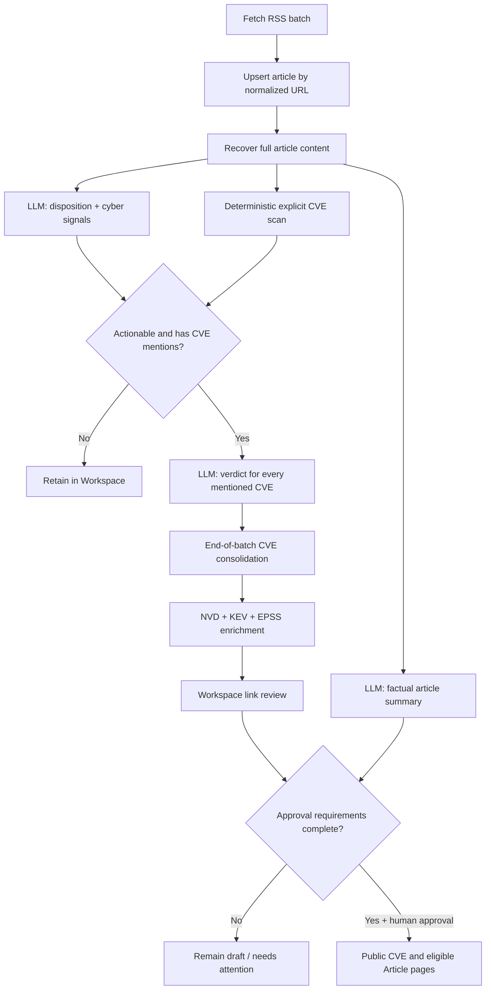

# CVE Intelligence MVP Architecture

## Outcome

Reframe Vendor Threat Watch as a CVE-centred, human-gated intelligence workflow rather than a vendor-filtered news digest. The MVP ingests low-volume cyber-news batches, extracts full articles, identifies explicit CVEs, evaluates each article–CVE relationship, enriches accepted cases with authoritative sources, and publishes only analyst-approved CVE evidence.

The system is an agentic workflow, not an autonomous investigator. LLMs perform bounded reasoning inside a deterministic, resumable pipeline; Postgres remains the system of record.

## Agent patterns

The MVP deliberately combines a small set of useful patterns:

- **Sequential workflow:** ingest → extract → scan → analyse → consolidate → enrich → review → publish.
- **Parallelization:** factual summary and disposition analysis run independently after full-text extraction.
- **Routing:** disposition and explicit CVE mentions determine whether CVE relevance analysis is eligible.
- **Tool use:** typed deterministic clients retrieve NVD, CISA KEV, and EPSS data; the LLM does not invent enrichment.
- **Human in the loop:** analysts confirm each public article–CVE link and approve each CVE case.
- **Evaluator feedback:** retained predictions, failures, and corrections feed a labelled scorecard for later automation.

An open-ended investigation agent, organizational asset matching through MDE, notification channels, and semantic event grouping are deferred.

## Workflow

## Stage contracts

### 1. Ingest and URL identity

- Repeated feed fetches converge on the existing unique normalized `canonical_url`.
- Normalization removes fragments and common tracking parameters.
- No content-hash, title-similarity, syndication, or semantic-event deduplication is added to the MVP.

### 2. Full-text extraction

- Every discovered article is retained.
- Final analysis requires source full text or a genuinely full-content RSS payload.
- Title and ordinary RSS excerpts may appear as temporary diagnostic context but cannot complete analysis or create CVE evidence.
- Extraction retries durably; exhausted work appears in Workspace `needs_attention`.

### 3. Deterministic CVE scanning

- Scan title, RSS summary, recovered body, and relevant source links after extraction.
- Accept only explicit, syntactically valid CVE identifiers.
- Normalize identifiers and retain mention location and evidence snippets.
- An LLM cannot add an identifier that the deterministic scan did not find.

### 4. Article analysis

Every analysis-ready article receives two independent LLM tasks:

1. A factual short summary, including for advertisements and non-actionable material.
2. A disposition (`actionable`, `non_actionable`, `uncertain`) plus zero or more cyber signals.

For an actionable article with explicit CVEs, one conditional call returns an independent relevance result for every mentioned CVE. Unusually large lists may be split into bounded chunks.

The ordinary path therefore uses at most three focused calls per article. There is no CVE-level synthesis call.

### 5. Batch consolidation

- Wait for eligible disposition and relevance work at the end of the low-volume batch.
- Consolidate completed `relevant` relationships into one draft case per canonical CVE identifier.
- Upsert case and evidence relationships idempotently.
- Retrying, uncertain, and `needs_attention` work remains queued without blocking completed evidence for other CVEs.
- Article summaries do not block draft creation; they block approval.

### 6. Deterministic enrichment

- Enrich each new case immediately from NVD, the CISA KEV catalogue, and EPSS.
- Keep CVSS, KEV, and EPSS as separate signals; do not calculate an organizational risk score without asset context.
- Order analyst attention deterministically by KEV, active exploitation evidence, EPSS, CVSS, and recency.
- Store source-specific append-only observations with provenance. Failed checks never replace the latest successful terminal observation.
- `NVD: not_found` is a visible terminal outcome for the current check and does not prove the CVE invalid.
- Maintain NVD through last-modified incremental synchronization, reconcile the full KEV catalogue, and refresh EPSS daily. Do not use an arbitrary 30-day window.

### 7. Human review and publication

- Review every article–CVE relationship independently as `relevant`, `not_relevant`, or `uncertain`.
- A CVE case needs at least one human-confirmed relevant link.
- Every relevant article needs a completed or human-written summary.
- NVD, KEV, and EPSS must each have a terminal check outcome.
- A human explicitly approves the case.
- If later review removes the final confirmed relevant link, the case automatically returns to draft.
- A temporary refresh failure does not unpublish a case because the latest successful observation remains valid.

## Public and Workspace surfaces

The primary navigation is `Article | CVE | Workspace`.

### Public CVE

- Canonical CVE identifier
- NVD description and CVSS
- CISA KEV status
- EPSS score and observation date
- Source provenance and retrieval timestamps
- Only human-confirmed relevant articles, each with its completed factual summary

### Public Article

An article appears publicly only when it is actionable, has a completed summary, and is a human-confirmed relevant link on an approved CVE case. Independent publication of non-CVE incidents is deferred.

### Workspace

Workspace retains all material, including non-actionable and uncertain articles, explicit mentions that did not create cases, LLM assessments, human corrections, task attempts, extraction failures, enrichment outcomes, and publication history.

## Durable state and module boundaries

`articles.processing_status` remains the coarse ingest/extraction lifecycle. Summary, disposition, and CVE-relevance work use a generic durable analysis-task mechanism because they run and retry independently.

Each analysis task receives up to five automatic attempts with increasing backoff. Exhausted work becomes `needs_attention`, remains incomplete, and may be retried or completed by an analyst. Existing append-only LLM audit data retains individual calls and prompt/model provenance.

One deep CVE module hides a compact relational write model:

- `cve_cases`
- one article–CVE lifecycle table for retained mentions, model assessments, and promoted evidence relationships
- one source-polymorphic enrichment observation table
- one append-only review-event table
- derived views for current Workspace and public reads

The pipeline and UI call the module's small interface rather than coordinating these tables directly. The generic analysis-task mechanism belongs to shared pipeline infrastructure, not to each CVE concern.

## Runtime ecosystem

- Existing TypeScript application and Next.js web surface
- Existing LangGraph runner for visible workflow orchestration
- Postgres for durable task state, retries, auditability, and domain truth
- Existing configured LLM client behind strict structured schemas and prompt versions
- Deterministic typed HTTP clients for NVD, CISA KEV, and EPSS
- Existing scheduler for low-volume batches
- No required Redis/BullMQ worker deployment in the MVP

## Confidence-building scorecard

Start with a representative labelled set of approximately 50–100 articles and retain real review outcomes. Report:

- disposition confusion matrix and actionable precision/recall
- explicit CVE extraction precision/recall
- per-relationship CVE relevance precision/recall
- factual summary human pass/correction rate
- extraction and analysis retry completion
- enrichment terminal-outcome coverage and freshness

Human approval—not an invented score threshold—is the first-release safety gate. Automation thresholds are a later decision based on observed errors.

## Explicitly deferred

- Monitored vendor/product filter as a gating condition
- MDE or organizational asset-impact matching
- Semantic article/event grouping
- Open-ended investigation agent and case synthesis
- Channel notifications and exactly-once delivery
- Composite company-risk score
- Independent publication workflow for non-CVE incidents
- Redis/BullMQ per-article push-through workers

## MVP completion criteria

- Repeated RSS URLs do not create duplicate articles.
- Every analysis-ready article reaches completed summary and disposition or a visible `needs_attention` state.
- Explicit CVE mentions and their evidence remain inspectable even when rejected.
- Relevant relationships consolidate into one draft case per CVE without duplicate links.
- NVD, KEV, and EPSS outcomes are independently visible with provenance and refresh behavior.
- Analysts can review each relationship and approve or withdraw a case.
- Only approved CVEs and their confirmed evidence articles appear publicly.
- The scorecard can compare model results with human outcomes.
